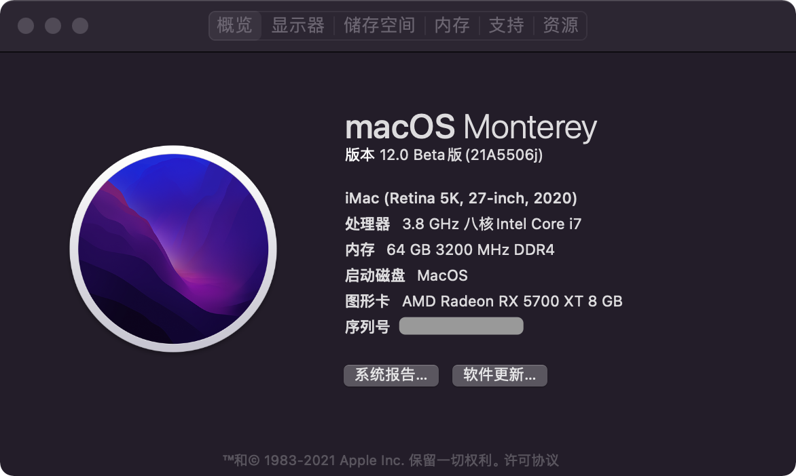
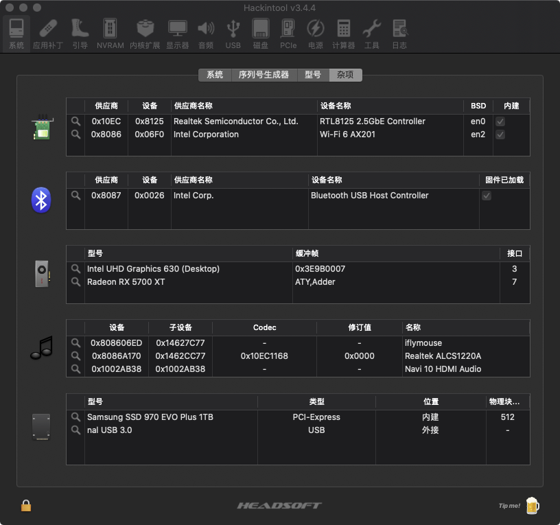
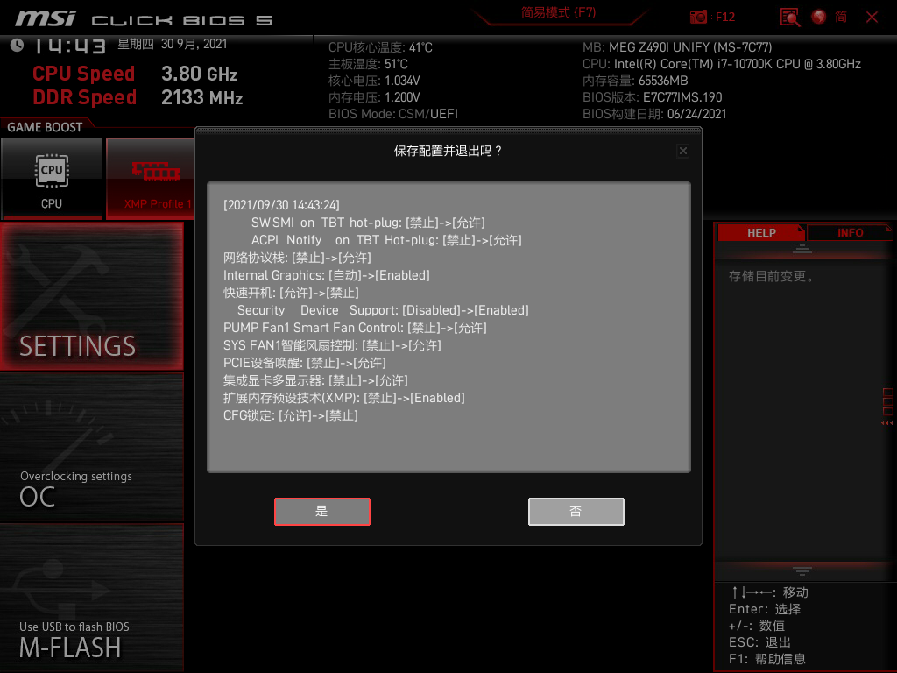

# Hackintosh-EFI-MSI-Z490i-Unify

## 介绍  
MSI-Z490i-Unify-Hackintosh  

## 说明  
MSI-Z490i-Unify 的黑苹果 EFI  
当前支持 Monterey 12.3.1

## 配置  
 规格     | 详细信息
 ---------|--------
 型号     |
 主板     | 微星 MEG Z490I UNIFY (MS-7C77)
 处理器   | 英特尔 Core i7-10700K @ 3.80GHz 八核
 内存     | 64 GB ( 海盗船 DDR4 3200MHz )
 硬盘     | 西数 WDS100T3X0C-00SJG0 SN750 ( 1 TB / 固态硬盘 )
 显卡     | AMD Radeon RX 5700 XT ( 8 GB / 蓝宝石 )
 无线网卡  | 英特尔® Wi-Fi 6 AX201 ( 板载 )
 声卡     | Realtek ALC S1220A
 触摸板   |
 触摸屏   |

## BIOS
||||
--|----------------------------------------|-----------
1 |Setting\高级\内建显示配置\集成显卡多显示器| [允许]
2 |Setting\高级\整合周边设备\网络协议栈      | [允许]
3 |OC\扩展内存预设技术(XMP)                 | [Enabled]
4 |OC\CPU Features\CFG Lock                | [Disabled]
  |                                        | 
5 |Security Device Support                 | [Enabled] （Win11 - TPM 2.0）

***或者使用微星主板自带的 D.T.M 功能，一键开启黑苹果所需设置。***  
*[参考附件 screenshot/MSI_SnapShot_微星一键黑苹果.bmp]*  

## 使用
 1. 有线网卡：  
    表现为网络中以太网显示电缆被拔出，无信号。  
	需要 高级--硬件--设置速度和双工，  
		速度：根据你的路由器来，如果是百兆的口，就选100，千兆的选1000。  
		双工：选节能以太网，如果还是不行，换其它的。  
	###### `可通过终端使用命令设置：`  
	- ###### `sudo ifconfig en0 media 1000baseT mediaopt full-duplex`  
	- ###### `sudo ifconfig en0 media 100baseTX mediaopt full-duplex`  

 2. 无线网卡 & 蓝牙：  
	BigSur：请替换 BigSur 的 AirportItlwm.kext。
	如果Wifi无法打开请尝试断电关机并重启。
	 
 3. 非 RX Vega 56/64 / RX 5700 系列 请尝试使用 config_iGPU.plist 启动。  
	RX Vega 56/64 / RX 5700 系列 请查看[AMD GPU #25](https://github.com/wjz304/Hackintosh-EFI-MSI-Z490i-Unify/issues/25) 或者尝试勾选 RadeonBoost.kext 进行优化。
	 
 4. 关于 Safari 不能看 Prime/Netflix 的问题。  
	请尝试修改机型为 iMacPro1,1 并删除集显注入 DeviceProperties -> PciRoot(0x0)/Pci(0x2,0x0) 部分。

 5. 如果使用 Samsung PM981 型号 会报 IONVMe 错误。  
    如果使用 Samsung 960 Evo/Pro 970 Evo/Pro 无故死机，请尝试修改 SetApfsTrimTimeout 为 999。  
	注意：  
	Monterey 12.3 以上 Samsung 硬盘 启动会很慢，可以重装解决，但是仍然建议更换非三星硬盘。  
	- ###### `log show --last boot | grep "trims took"`  
	###### 980 Pro：kernel: (apfs) spaceman_scan_free_blocks:3154: disk1 scan took 212.092312 s, trims took 212.054291 s  
	###### SN750：kernel: (apfs) spaceman_scan_free_blocks:3153: disk1 scan took 0.319178 s, trims took 0.313471 s

 6. 显示器声音控制软件：[MonitorControl](https://github.com/MonitorControl/MonitorControl)
 
## 预览
    
    
    
  
## 鸣谢
https://github.com/2742280997/z490i-unify  
https://github.com/kingwood77/MSI-Z490i-Unify-Hackintosh  
https://github.com/milkpeanut/MSI-Z490I-UNIFY-Hackintosh  
https://github.com/kreactnative/EFI-z490-ace-10700k-bigSur  

https://github.com/acidanthera/OpenCorePkg  
https://gitee.com/btwise/OpenCore_NO_ACPI  

https://github.com/OpenIntelWireless/itlwm  
https://github.com/OpenIntelWireless/HeliPort  

https://github.com/dortania/bugtracker/issues/192  

