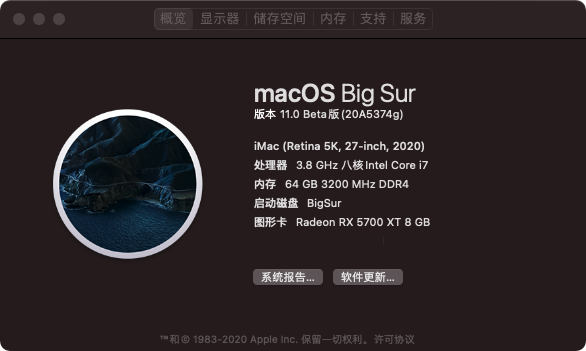

# Hackintosh-EFI-MSI-Z490i-Unify-Hackintosh

#### 介绍
MSI-Z490i-Unify-Hackintosh  

#### 说明
MSI-Z490i-Unify 的黑苹果 EFI  

当前支持 ~~Catalina 10.15.7 和~~ BigSur 11.4  
*"2021/05/08 不再对 Catalina 进行测试"*

#### 配置
| 规格     | 详细信息                                                                       |
| -------- | ------------------------------------------------------------------------------ |
| 型号     |                                                                                |
| 主板     | 微星 MEG Z490I UNIFY (MS-7C77)                                                 |
| 处理器   | 英特尔 Core i7-10700K @ 3.80GHz 八核                                           |
| 内存     | 64 GB ( 海盗船 DDR4 3200MHz )                                                  |
| 硬盘     | 三星 SSD 980 PRO 1TB ( 1 TB / 固态硬盘 )                                       |
| 显卡     | AMD Radeon RX 5700 XT ( 8 GB / 蓝宝石 )                                        |
| 无线网卡 | 英特尔® Wi-Fi 6 AX201 ( 板载 )                                                 |
| 声卡     |                                                                                |
| 触摸板   |                                                                                |
| 触摸屏   |                                                                                |

#### BIOS
1.Setting\高级\内建显示配置\集成显卡多显示器 [允许]  
2.Setting\高级\整合周边设备\网络协议栈       [允许]  
3.OC\扩展内存预设技术(XMP)                   [Enabled]  
4.OC\CPU Features\CFG Lock                   [Disabled]  

#### 使用
 **使用说明:** 
 1. 有线网卡：
    表现为网络中以太网显示电缆被拔出，无信号。
	需要 高级--硬件--设置速度和双工，
		速度：根据你的路由器来，如果是百兆的口，就选100，千兆的选1000。
		双工：选节能以太网，如果还是不行，换其它的。
 
 2. 无线网卡：
    ~~需要配合安装 HeliPort 后进行链接。https://github.com/OpenIntelWireless/HeliPort  
	链接后，设置 HeliPort.APP 开机自启动即可开机自动链接WiFi。~~  
	连接其他Wi-Fi前或者连接Wi-Fi后出现入不了网的情况，一定要提前先去「网络偏好设置/TCP&IP」界面内点击「DHCP续租」，它才能恢复工作。  
	*"2021/05/08 修改使用 bigsur AirportItlwm.kext，不需要安装 HeliPort"*  

 3. 蓝牙：
     ~~10.15.7 低概率会挂掉。~~ *"2021/05/08 不在对 Catalina 测试"*  
	 11.2.3 可连部分设备。

   
   
  
  
#### 鸣谢
https://github.com/2742280997/z490i-unify  
https://github.com/kingwood77/MSI-Z490i-Unify-Hackintosh  
https://github.com/milkpeanut/MSI-Z490I-UNIFY-Hackintosh  
https://github.com/kreactnative/EFI-z490-ace-10700k-bigSur  

https://github.com/acidanthera/OpenCorePkg  
https://gitee.com/btwise/OpenCore_NO_ACPI  

https://github.com/OpenIntelWireless/itlwm  
https://github.com/OpenIntelWireless/HeliPort  

